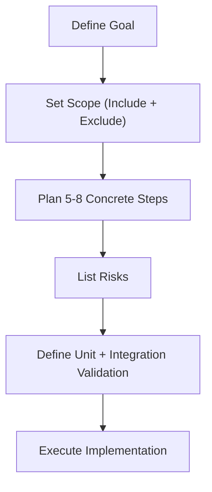

# TASK PLAN

## Goal
- [ ] Clear description of the final outcome
- [ ] What changes after implementation

## Scope
- [ ] What parts of the system are affected
- [ ] What is explicitly NOT included
- [ ] What NOT to include in the implementation

## Steps
1. [Step name]
   - files: [specific files or modules]
   - actions: [what changes will be made]
   - validation: [how to verify this step]
2. [Step name]
   - files: [specific files or modules]
   - actions: [what changes will be made]
   - validation: [how to verify this step]
3. [Step name]
   - files: [specific files or modules]
   - actions: [what changes will be made]
   - validation: [how to verify this step]
4. [Step name]
   - files: [specific files or modules]
   - actions: [what changes will be made]
   - validation: [how to verify this step]
5. [Step name]
   - files: [specific files or modules]
   - actions: [what changes will be made]
   - validation: [how to verify this step]

## Risks
- [ ] Potential issues or edge cases

## Validation
- [ ] Unit test commands/checks
- [ ] Integration test commands/checks
- [ ] Additional commands or checks to confirm everything works

## Rules
- [ ] Max 5-8 steps
- [ ] Each step MUST include files, actions, validation
- [ ] No vague steps like "implement logic"
- [ ] Prefer modifying existing files over creating new ones

